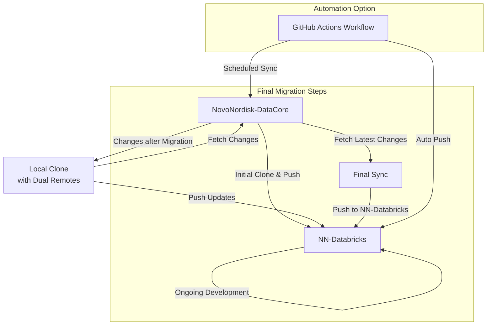

# GitHub Repository Migration Process

This document outlines the process for migrating repositories from the `NovoNordisk-DataCore` organisation to `NN-Databricks` while supporting incremental updates.

---

## 📋 **Migration Workflow**



## Initial Migration
For the initial migration, we can clone and push.

### Migration Steps
```
# Clone the repository from NovoNordisk-DataCore
git clone --mirror https://github.com/NovoNordisk-DataCore/repo-name.git
cd repo-name.git

# Push to the NN-Databricks
git remote set-url origin https://github.com/NN-Databricks/repo-name.git
git push --mirror
```
- `--mirror` ensures all branches, tags, and history are copied.

## Tracking Changes After Migration
Since changes may happen in both repositories, setting up a way to sync differences later is crucial. The best way is to periodically pull from `NovoNordisk-DataCore` and push to `NN-Databricks`.

### Add Remotes for Tracking

On your local machine or in a github action:
```
# Clone from NN-Databricks
git clone https://github.com/NN-Databricks/repo-name.git
cd repo-name

# Add NovoNordisk-DataCore as a remote
git remote add old-origin https://github.com/NovoNordisk-DataCore/repo-name.git

# Fetch latest changes from NovoNordisk-DataCore
git fetch old-origin
```
## Merging Changes Before Final Cutover

When we are ready to finalize the migration:

### Pull and Push New Changes

```
# Fetch and merge changes from NovoNordisk-DataCore
git fetch old-origin
git merge old-origin/main  

# Push changes to the new organization
git push origin main
```
For multiple branches:
```
git branch -r  # List all remote branches
git checkout feature-branch
git merge old-origin/feature-branch
git push origin feature-branch
```
## Automate Incremental Sync with GitHub Actions 
We could set up a GitHub Action in `NN-Databricks` to pull changes from `NovoNordisk-DataCore` automatically:

```
name: Sync from NovoNordisk-DataCore

on:
  schedule:
    - cron: '0 0 * * *'  # Runs daily at midnight
  workflow_dispatch:      # Manual trigger

jobs:
  sync-repositories:
    runs-on: ubuntu-latest
    strategy:
      matrix:
        repo-name: [repo1, repo2, repo3]  # List of repositories to sync

    steps:
      - name: Generate GitHub App Token
        id: generate_token
        uses: tibdex/github-app-token@v1  
        with:
          app_id: ${{ secrets.GH_APP_ID }}
          private_key: ${{ secrets.GH_APP_PRIVATE_KEY }}

      - name: Checkout NN-Databricks Repo
        uses: actions/checkout@v4
        with:
          repository: NN-Databricks/${{ matrix.repo-name }}
          token: ${{ steps.generate_token.outputs.token }}

      - name: Set Up Git
        run: |
          git config --global user.name "GitHub Action"
          git config --global user.email "action@github.com"

      - name: Add NovoNordisk-DataCore Remote and Sync
        run: |
          git remote add old-origin https://x-access-token:${{ steps.generate_token.outputs.token }}@github.com/NovoNordisk-DataCore/${{ matrix.repo-name }}.git
          git fetch old-origin
          git merge old-origin/main --allow-unrelated-histories || echo "No changes to merge"
          git push origin main


```

